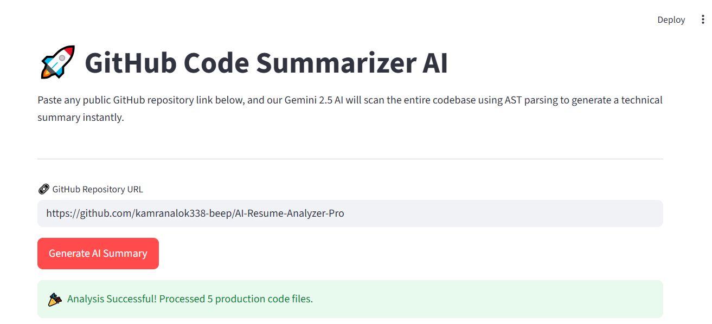
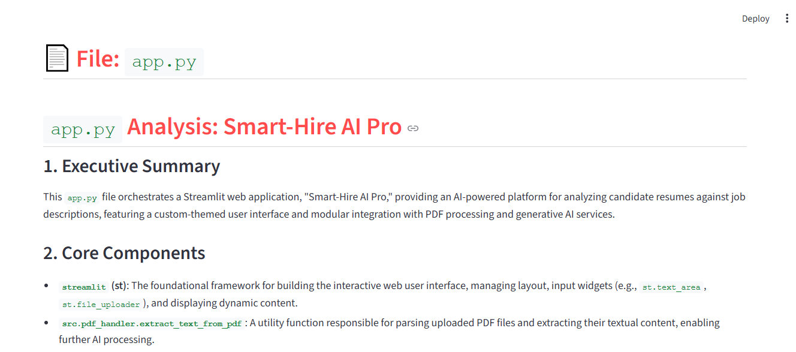

# 🌟 GitHub Code Architecture Summarizer

An automated pipeline that converts entire GitHub repositories into high-fidelity architectural documentation using AST dependency mapping and Google Gemini 2.5 Flash.



## 🚀 Key Features

* **Intelligent BFS Traversal:** Fetches repository structures via GitHub REST API while skipping heavy binaries and dependencies.
* **AST Dependency Mapping:** Inspects source files using Python's native `ast` module to build accurate module-level maps.
* **AI Architecture Synthesis:** Generates high-fidelity summaries, component descriptions, and algorithmic complexity analysis (\(O(n)\)/\(O(1)\)).
* **Decoupled Architecture:** Features an independent, production-ready FastAPI backend isolated from the Streamlit UI dashboard.
* **Robust Error Handling:** Custom exception frameworks manage API rate limits and structural boundary drops gracefully.

---

## 🛠️ Tech Stack

* **Backend:** FastAPI (Asynchronous Web Server Gateway Interface)
* **LLM Orchestration:** LangChain Core Integration Framework
* **Core Model AI:** Google Gemini 2.5 Flash API
* **Syntax Compilation:** Native Python `ast` Engine
* **Frontend UI:** Streamlit Interactive Framework
* **Styling & Security:** Production Custom CSS & `python-dotenv`

---

## 📦 Operational Workflow

```text
[GitHub Repo] ──> [BFS Repository Traversal] ──> [AST Parsing] ──> [LangChain + Gemini] ──> [Regex Sanitization] ──> [Streamlit UI]
```

1. **Source Code Extraction:** Downloads raw files dynamically via GitHub API while ignoring media and assets.
2. **Abstract Syntax Parsing:** Feeds raw tokens into an AST engine to determine system dependency hierarchies.
3. **Generative Intelligence Engine:** Structures code semantics through LangChain into the Gemini model.
4. **Sanitization Utility:** Employs precise regex logic to clean raw LLM tokens into structured Markdown outputs.

---

## 📁 Repository Structure

```text
github_code_summarizer/
├── backend/
│   ├── api/
│   │   └── routes.py            # FastAPI Request Router
│   ├── core/
│   │   ├── config.py            # Environment Secure Loader
│   │   └── exceptions.py        # Custom Pipeline Exceptions
│   ├── services/
│   │   ├── github_parser.py     # BFS Repo Traversal Mechanism
│   │   ├── graph_builder.py     # AST Dependency Mapping Service
│   │   └── llm_explainer.py     # Gemini LLM Orchestration Logic
│   ├── utils/
│   │   └── text_cleaner.py      # Token Sanitization Regex Engine
│   └── main.py                  # Server Lifecycle Bootstrapper
├── frontend/
│   ├── app.py                   # Streamlit Presentation Layer
│   └── styles.css               # Production UI Core Styling
├── docs/
│   ├── dashboard.png            # Main Dashboard Screenshot
│   └── analysis_output.png      # AI Generated Analysis Screenshot
├── .env.example                 # Sample Environment Configuration
├── .gitignore                   # Version Control Security Filtering
└── requirements.txt             # Unified Dependency Specification File
```

---

## ⚙️ Core API Specification

### Analyze Repository
* **Endpoint:** `/api/analyze`
* **Method:** `POST`
* **Content-Type:** `application/json`

#### Request Payload
```json
{
  "repo_url": "https://github.com/karpathy/micrograd"
}
```

#### Response Scheme (`200 OK`)
```json
{
  "status": "success",
  "total_files_analyzed": 6,
  "documentation_generated": "# AI System Architecture... [Markdown Content]"
}
```

---

## ⚡ Local Setup & Environment Security


### 1. Clone the Workspace
```bash
git clone https://github.com
cd github-code-summarizer
```

### 2. Environment Configuration
Duplicate the provided environment template and populate it with your personal API credentials:
```bash
cp .env.example .env
```

Now, open the newly created `.env` file and insert your production keys:
```env
GITHUB_TOKEN=github_pat_your_actual_token_string_here
GEMINI_API_KEY=AIzaSy_your_actual_api_key_string_here
```

### 3. Install Dependencies
```bash
pip install -r requirements.txt
```

### 4. Run Application Subsystems

Launch the following microservices in separate terminal sessions:

#### Terminal 1: Asynchronous FastAPI Backend
```bash
python -m backend.main
```
* Service URL: `http://127.0.0.1:8000`

#### Terminal 2: Interactive Streamlit UI
```bash
streamlit run frontend/app.py
```
* Interface URL: `http://localhost:8501`


## 📸 Screen Previews

### 1. High-Fidelity Technical Analysis

